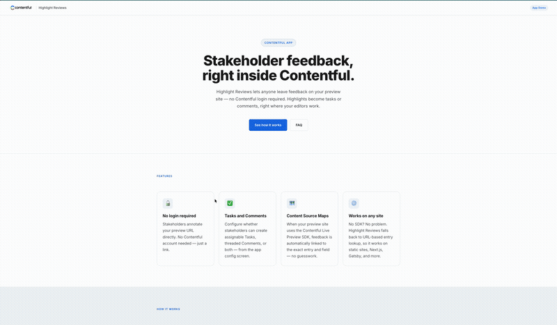

# Highlight Reviews

A Contentful sample app that lets stakeholders highlight text on a preview site and leave feedback — as Tasks or Comments on the corresponding Contentful entry — without needing a Contentful login.



> **Disclaimer:** Contentful provides this sample code solely to demonstrate a technical scenario. Any and all sample code provided by Contentful is not intended for production use. Contentful is not responsible for maintaining or supporting this sample code after it has been provided to you.

---

## How it works

1. A stakeholder visits your preview URL.
2. They select any text on the page — a popover appears asking for their feedback.
3. They write a note, optionally enter their name, and choose to create a Task or add a Comment.
4. The feedback appears instantly on the relevant entry in Contentful, linked to the specific field where the highlighted text lives.

No Contentful account required for the reviewer. All CMA calls are proxied through a server that holds your credentials.

---

## Repository structure

```
packages/
  overlay/   @highlight-reviews/overlay — browser overlay (ESM + IIFE builds)
  next/      @highlight-reviews/next    — Next.js App Router handler factory
server/      Standalone Vercel proxy (used by the demo and Option A deployments)
demo/
  site/      Demo site source (HTML with __PLACEHOLDER__ tokens)
  scripts/   setup.ts — creates content types, seeds entries, writes .env.demo
             build-demo.ts — patches demo site from .env.demo, writes server/public/index.html
```

---

## Installation

### Option A — Any preview site (script tag)

**Step 1: Deploy the proxy**

Click the button below to deploy the API proxy to Vercel. You'll be prompted for your Contentful credentials.

[](https://vercel.com/new/clone?repository-url=https://github.com/choicelildice/highlight-reviews&root-directory=server&env=CMA_TOKEN,SPACE_ID,ENVIRONMENT_ID,ALLOWED_ORIGIN&envDescription=Contentful%20credentials%20for%20the%20CMA%20proxy)

| Variable         | Description                                                                   |
|------------------|-------------------------------------------------------------------------------|
| `CMA_TOKEN`      | Contentful Personal Access Token                                              |
| `SPACE_ID`       | Your Contentful space ID                                                      |
| `ENVIRONMENT_ID` | Environment ID (default: `master`)                                            |
| `ALLOWED_ORIGIN` | Your preview site's origin, e.g. `https://preview.mysite.com` (or `*`)       |

**Step 2: Add the overlay to your site**

```html
<script>
  window.HighlightReviewsConfig = {
    apiBase: 'https://your-vercel-deployment.vercel.app',
    spaceId: 'your-space-id',
    environmentId: 'master',     // optional, defaults to master
    enableTasks: true,
    enableComments: true,
    showAssignee: true,          // optional, shows assignee dropdown on tasks
    locale: 'en-US',             // optional, defaults to en-US
    reviewerName: 'Stakeholder', // optional, skips the name prompt
  };
</script>
<script src="https://unpkg.com/@highlight-reviews/overlay/dist/overlay.iife.js"></script>
```

---

### Option B — Next.js project (npm)

No separate Vercel deployment needed — the API route lives inside your own app.

**Step 1: Install the packages**

```bash
npm install @highlight-reviews/overlay @highlight-reviews/next
```

**Step 2: Add the API route**

Create `app/api/highlight-reviews/[...route]/route.ts`:

```ts
import { createAppRouterHandlers } from '@highlight-reviews/next';

const { GET, POST, OPTIONS } = createAppRouterHandlers({
  cmaToken: process.env.CMA_TOKEN!,
  spaceId: process.env.CONTENTFUL_SPACE_ID!,
  environmentId: process.env.CONTENTFUL_ENVIRONMENT_ID ?? 'master',
});

export { GET, POST, OPTIONS };
```

Add to your `.env.local`:

```
CMA_TOKEN=your-personal-access-token
CONTENTFUL_SPACE_ID=your-space-id
```

**Step 3: Initialise the overlay**

In your preview layout or root component:

```ts
import { init } from '@highlight-reviews/overlay';

init({
  apiBase: '/api/highlight-reviews',
  spaceId: process.env.NEXT_PUBLIC_CONTENTFUL_SPACE_ID!,
  enableTasks: true,
  enableComments: true,
  showAssignee: true,
});
```

---

## Field-level feedback

For comments and tasks to be linked to the exact field that was highlighted, add `data-contentful-entry-id` and `data-contentful-field-id` attributes to your rendered elements:

```html
<h1 data-contentful-entry-id="abc123" data-contentful-field-id="headline">
  My headline
</h1>
<p data-contentful-entry-id="abc123" data-contentful-field-id="body">
  Body copy here.
</p>
```

The [Contentful Live Preview SDK](https://www.contentful.com/developers/docs/tools/live-preview/) adds these automatically. Without them, Highlight Reviews falls back to URL-based entry lookup (matching the path slug against `fields.slug` in the CDA) and then a configured `defaultEntryId`.

---

## Configuration reference

| Option           | Type      | Default       | Description                                                        |
|------------------|-----------|---------------|--------------------------------------------------------------------|
| `apiBase`        | `string`  | —             | Base URL of the proxy server (required)                            |
| `spaceId`        | `string`  | —             | Contentful space ID (required)                                     |
| `environmentId`  | `string`  | `"master"`    | Contentful environment ID                                          |
| `enableTasks`    | `boolean` | `true`        | Allow stakeholders to create Tasks                                 |
| `enableComments` | `boolean` | `true`        | Allow stakeholders to add Comments                                 |
| `showAssignee`   | `boolean` | `true`        | Show assignee dropdown on Tasks (fetches space members via proxy)  |
| `locale`         | `string`  | `"en-US"`     | Locale for field-level comment pinning                             |
| `reviewerName`   | `string`  | —             | Pre-fill the reviewer name, hiding the name input                  |
| `defaultEntryId` | `string`  | —             | Fallback entry ID when DOM attributes and URL lookup both fail     |

---

## Demo site

The `demo/` directory contains a fully working standalone example — a Contentful-branded marketing page that fetches its content from the CDA and has the overlay pre-installed.

```bash
npm install
npm run setup       # creates content types, seeds entries, writes .env.demo
npm run build:demo  # patches the demo site and builds all packages
cd server && vercel --prod --yes
```

`setup` will prompt for your space credentials and ask which feedback types to enable. Those choices are written to `.env.demo` and baked into the demo site at build time.

---

## npm scripts

| Script                  | Description                                               |
|-------------------------|-----------------------------------------------------------|
| `npm run setup`         | Create content types and seed demo entries in a space     |
| `npm run build:overlay` | Build overlay package (ESM + IIFE)                        |
| `npm run build:next`    | Build Next.js handler package                             |
| `npm run build:packages`| Build both packages                                       |
| `npm run build:demo`    | Build packages + patch demo site from `.env.demo`         |
